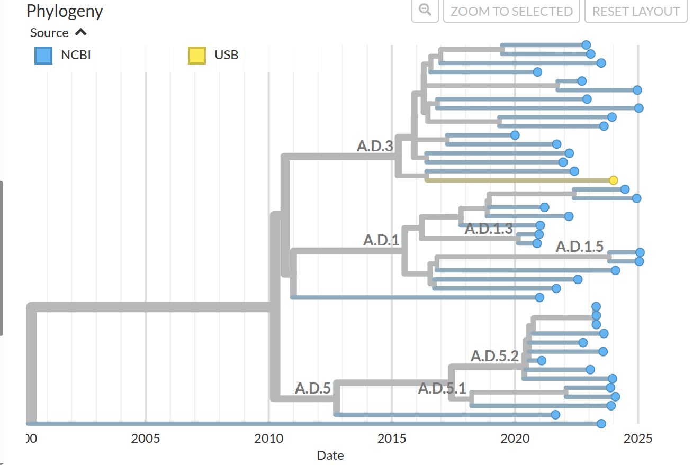

# rsv_epidemiology_2025
A collection of code and data used for **"Molecular Epidemiology of Respiratory Syncytial Virus in Switzerland from 2020 to 2024"** publication.

---

## `src/genome_assembly`
This directory contains input data and metadata used for genome assembly and downstream analysis of RSV samples.

### `data/` Folder Structure

```
data/
├── annotation.tsv
├── primers/
├── ref_genomes/
└── samples/
```

---

#### `annotation.tsv`

Sample metadata file.  
**Columns:**
- `NGS_ID`: Full sample ID (matches FASTQ filenames)
- `Virus Type`: Either `HRSVA` or `HRSVB`
- `amplicon_types`: Comma-separated amplicon types (`500bp, 1000bp, 2000bp` in the original analysis)
- `Pools`: `Pool 1, Pool 2` in the original analysis, different for separate even/odd amplicon pool experiments

---

#### `primers/`

CSV files specifying primer schemes used for different virus types and amplicon sizes.

Naming: `rsv_{a|b}_primers_{500bp|1000bp|2000bp|revised}{|_even|_odd}.csv`

- RSV A or B;
- Amplicon sizes; revised for pooled together from the original analysis;
- empty for combined odd & even amplicons, different otherwise.

---

#### `ref_genomes/`

Reference genome FASTA files:
- `rsva_ref.fasta`
- `rsvb_ref.fasta`

*(Additional BWA index files may be created here, can be cleaned with `cleanup`)*

---

#### `samples/`

One folder per sample (named by `NGS_ID` in `annotation.tsv`). Each contains:

```
<NGS_ID>/
├── <NGS_ID>_R1.fastq.gz
└── <NGS_ID>_R2.fastq.gz
```

---

### Configuration (`config.yaml`)

The `config.yaml` file specifies various parameters for running the pipeline. Below is a breakdown of the options in the current configuration:

| Parameter         | Description                                                                 | Example                   |
|-------------------|-----------------------------------------------------------------------------|---------------------------|
| `base_dir`        | The base directory where the project is located.                            | `"."` (current directory)  |
| `res_dir_name`    | The name of the directory where results will be stored.                     | `"results"`                |
| `ann_filename`    | The name of the annotation file in `src/genome_assembly/data`. This file containis metadata for the samples. | `"annotation.tsv"`         |
| `read_length`     | TrimGalore min length.                     | `80`                       |
| `min_cov`         | The minimum coverage threshold for variants.                               | `100`                      |
| `freq_threshold`  | The frequency threshold: bases with the main allele of lower values are treated as undefined                     | `0.9`                      |
| `allow_cleanup`   | A flag that determines if intermediate files should be cleaned up after execution. Set to `True` to enable cleanup. | `True`                     |

### Example Commands

Here are some example commands run from `src/genome_assembly`:

#### 1. **Run the genome assembly pipeline**
```bash
snakemake --configfile config.yaml --cores 1 --use-conda -p
```

#### 2. **Cleanup intermediate files**
```bash
snakemake cleanup --cores 1
```

---

## Phylogeny Analysis

This is the Nextstrain build for respiratory syncytial virus (RSV).

### Input Data

Input metadata and sequences for RSV-A and RSV-B are available via <https://data.nextstrain.org>

- [RSV-A sequences](https://data.nextstrain.org/files/workflows/rsv/a/sequences.fasta.xz)
- [RSV-A metadata](https://data.nextstrain.org/files/workflows/rsv/a/metadata.tsv.gz)

- [RSV-B sequences](https://data.nextstrain.org/files/workflows/rsv/b/sequences.fasta.xz)
- [RSV-B metadata](https://data.nextstrain.org/files/workflows/rsv/b/metadata.tsv.gz)

These data are generously shared by labs around the world and deposited in NCBI genbank by the authors.
Please contact these labs first if you plan to publish using these data.
RSV sequences and metadata can be downloaded in the `/ingest` folder using
`nextstrain build --cpus 1 ingest` or `nextstrain build --cpus 1 .` if running directly from the `/ingest` directory.

The ingest pipeline is based on the Nextstrain mpox ingest workflow (<https://github.com/nextstrain/mpox/tree/master/ingest>).
Running the ingest pipeline produces `ingest/data/{a,b}/metadata.tsv` and `ingest/data/{a,b}/sequences.fasta`.

#### `ingest/vendored`

This repository uses [`git subrepo`](https://github.com/ingydotnet/git-subrepo) to manage copies of ingest scripts in [`ingest/vendored`](./ingest/vendored), from [nextstrain/ingest](https://github.com/nextstrain/ingest). To pull new changes from the central ingest repository, first install `git subrepo`, then run:

See [ingest/vendored/README.md](./ingest/vendored/README.md#vendoring) for instructions on how to update the vendored scripts.

### Run Analysis Pipeline

The workflow produces whole genome and G gene trees for RSV-A and RSV-B.
To run the workflow, use `snakemake -j4 -p --configfile config/configfile.yaml` and `nextstrain view auspice` to visualise results.

### Installation

Follow the standard [installation instructions](https://docs.nextstrain.org/en/latest/install.html) for Nextstrain's suite of software tools.

### Data use

We gratefully acknowledge the authors, originating and submitting laboratories of the genetic sequences and metadata for sharing their work. Please note that although data generators have generously shared data in an open fashion, that does not mean there should be free license to publish on this data. Data generators should be cited where possible and collaborations should be sought in some circumstances.

### Update example data

[Example data](./example_data/) is used by [CI](https://github.com/nextstrain/rsv/actions/workflows/ci.yaml). It can also be used as a small subset of real-world data.

Example data should be updated every time metadata schema is changed. To update, run:

```sh
nextstrain build --docker . update_example_data -F
```


### Sending data to the `nextclade_data` repo

From within the destination directory, run
```
rsync -a <path-to>/rsv/nextclade/datasets/ .
```
### Updates for lab samples analysis:

To construct a tree with an addition of lab samples, the annotation and the sequences have to be located in `input_lab_samples/{a_or_b}/` with the following names:
- **Lab Annotation (`comb_ann.tsv`)**:
The lab annotation TSV file includes sample details, including patient number (`Patient_Nr`), year of sample collection (`Year`), month of sample collection (`Months`), and unique identifiers (`NGS_ID`). The `NGS_ID` field is used as the index for merging the metadata.
- **Nextclade Results (`nextclade_results.tsv`)**:
The TSV file is generated by the Nextclade tool from the same sequences, it contains columns related to the quality of the sequence and the clade assignment of lab samples, such as `clade`, `qc.overallScore`, `qc.overallStatus`, `alignmentScore`, `alignmentStart`, `alignmentEnd`, `coverage`
- `sequences.fasta`:
FASTA file with the same indices, as `NGS_ID` values.

The pipeline then concatenates these sequences and annotation with the opensource ones, constructs a tree for all lab samples + a selected number of background open-source ones. Otherwise, the pipeline works as the master one. One can add filters by country/region, modifying `rsv_epidemiology_2025/src/phylogenetic_analysis/workflow/snakemake_rules/core.smk`, `--query` in the `filter_os` rule. For example:
```
        --query "({params.min_coverage}) & (source == 'NCBI') & (region == 'Europe')"
```

            

### Results: Phylogenetic Tree Analysis

The following phylogenetic tree is an example of RSV A tree on lab and open-source RSV samples, colored by origin: NCBI or USB (University Hospital Basel).



### Example Commands

Here are some example commands run from `src/phylogenetic_analysis`:

#### 1. **Run the phylogeny reconstruction pipeline**
```bash
snakemake --cores 1 --use-conda -p
```

#### 2. **Cleanup**
```bash
snakemake clobber --cores 1
```

---
